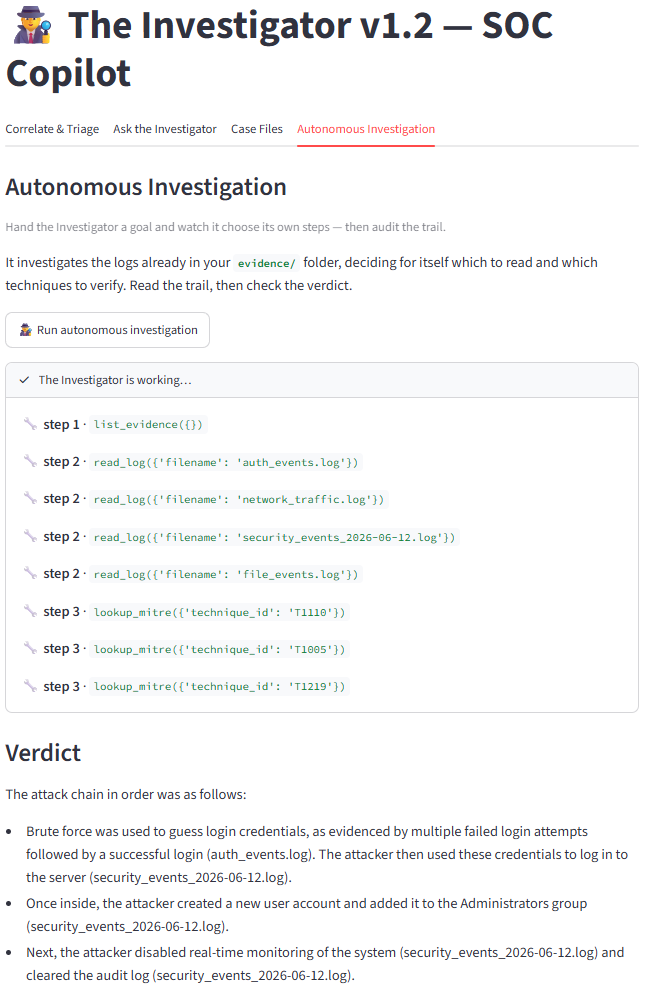

# The Investigator — AI Security & Network Copilot

An AI-powered security analyst that helps investigate cyber incidents by correlating logs, detecting suspicious activity, mapping findings to the MITRE ATT&CK framework, and generating actionable incident reports. The Investigator combines AI-assisted analysis with transparent evidence review to support both security professionals and students learning incident response.

🔗 Live App: https://the-investigator-yf4chngyyepi7ww7krozvp.streamlit.app/

📦 Docker Hub: https://hub.docker.com/repositories/stephenredbird

---

## Screenshot



---

## What It Does

### Correlate & Triage
Upload logs from multiple sources and receive a single correlated incident report that includes:

- MITRE ATT&CK mappings
- Severity assessment
- Investigation plan
- Recommended response actions

### Email Security Analysis
Analyze suspicious emails by reviewing:

- SPF validation
- DKIM validation
- DMARC results
- Reply-To mismatches
- Urgency, authority, and social engineering indicators

### Log Analysis & Threat Hunting

The Investigator can:

- Analyze server logs for failed-login and brute-force activity
- Detect beaconing and suspicious network patterns
- Reconstruct incident timelines from multiple log sources
- Identify indicators that may suggest compromise

### Ask the Investigator

Chat with an AI-powered SOC analyst to:

- Review findings
- Explain incident details
- Discuss MITRE ATT&CK techniques
- Recommend response actions

### Case Files

Store and review previous investigations through saved Markdown reports.

### Autonomous Investigation

Provide evidence and an investigation goal, and the agent will:

- Determine which tools to use
- Examine available logs
- Document its actions
- Build an attack narrative
- Produce a final evidence-based verdict

Every tool invocation is visible to the analyst for review and validation.

---

## Tech Stack

- **Python**
- **Streamlit** (Web Application)
- **Groq / Llama Models** (SOC Copilot)
- **Ollama** (Local AI Models)
- **GitHub Actions** (Automated Triage Pipeline)
- **Docker** (Containerized Deployment)
- **MITRE ATT&CK Framework** (Technique Mapping)


---

## Run Locally

Clone the repository:

```bash
git clone https://github.com/stephen-redbird/the-investigator.git
cd the-investigator
```

Install dependencies:

```bash
pip install -r requirements.txt
```

Add your API key:

```toml
# .streamlit/secrets.toml

GROQ_API_KEY="your_key_here"
```

Start the application:

```bash
streamlit run app.py
```

---

## Disclaimer

The Investigator is designed to assist analysts, not replace them. AI-generated findings should always be validated against the underlying evidence before operational decisions are made.

---

## Author

Stephen Redbird

- GitHub: https://github.com/stephen-redbird
- Docker Hub: https://hub.docker.com/repositories/stephenredbird
